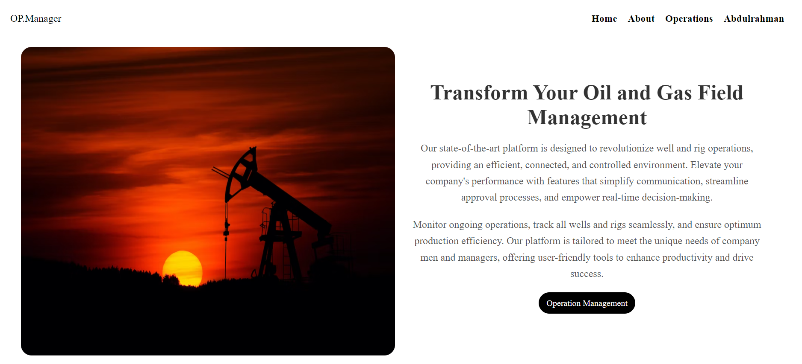
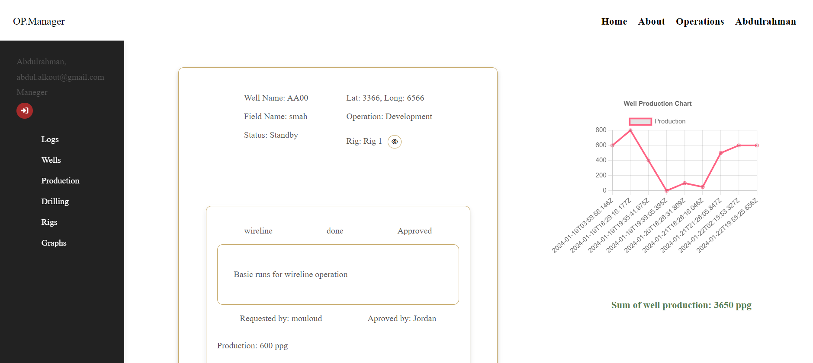
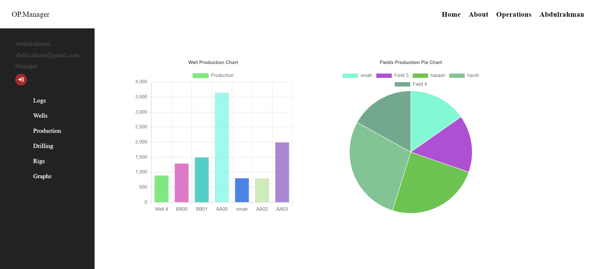

# Operation Activity Tracker

## Description

The Operation Activity Tracker is a MERN Stack application designed to track well operations and activities. It allows users to add, edit, and view details about different well operations. The project showcases the use of React, state management, form handling, and communication with a backend server to store and retrieve data.

## Table of Contents

- [How to Access](#how-to-access)
- [Code Structure](#code-structure)
- [Technologies Used](#technologies-used)
- [Screenshots](#screenshots)
- [Contact](#contact)

## How to Access

To use the Operation Activity Tracker, access it through your web browser. No installation is required.

[Operation Activity Tracker](#)
[Operation Activity Tracker GitHub](https://github.com/abdulalkout/operation_manager.git)

## Code Structure

The project is organized into the following folders:

1. **Components:**

   - Contains reusable React components used throughout the application.

2. **Contexts:**

   - Consists of context providers, such as ApiContext, used for managing global state.

3. **Images:**

   - Stores images used in the project, enhancing the visual experience.

4. **Utilities:**

   - Houses utility functions or modules that might be used across the application.

5. **Pages:**

   - Contains page components representing different sections of the application, including well details and operation activities.

## Technologies Used

The project utilizes the following technologies:

- React
- React Hooks
- React Router
- Context API for state management
- Axios for making HTTP requests
- Node, and Express.js for backend
- Mongoose for data base

## Screenshots

## Contact

For any questions or feedback, feel free to reach out:

- Email: abdul.alkout@gmail.com
- LinkedIn: https://www.linkedin.com/in/abdul-alkout/
- GitHub: https://github.com/abdulalkout

Feel free to use and explore the Operation Activity Tracker! Thank you for choosing our platform for managing well operations and activities.
